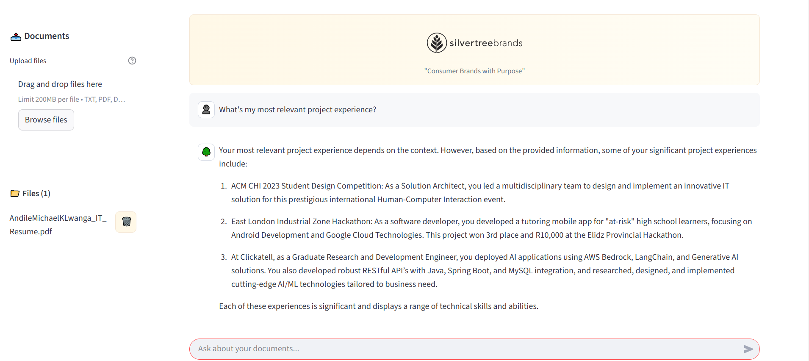
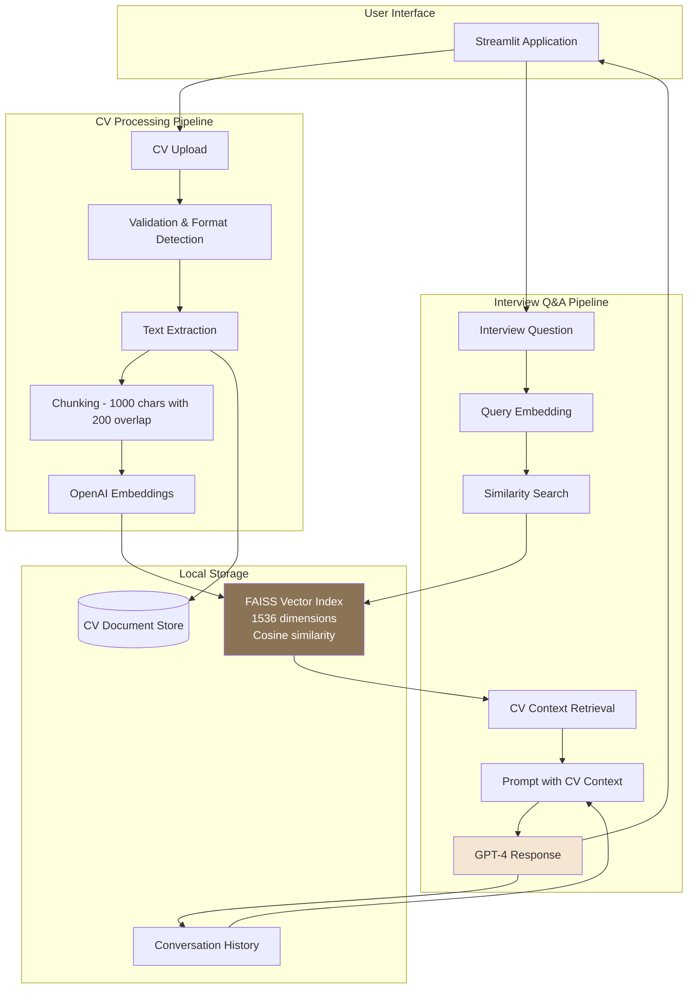

# CV Interview Assistant: RAG-Powered Resume Chatbot

An AI-powered interview preparation tool that transforms your CV into an intelligent conversational agent. Built with FAISS for vector storage, OpenAI embeddings, and GPT-4. Developed for Silvertree Brands using Streamlit and LangChain.


---

## Table of Contents
- Overview
- Business Context
- Technology Stack
- System Architecture
- Installation
- Configuration
- Knowledge Base
- Usage
- Deployment
- Project Structure
- Technical Documentation
- Troubleshooting
- Contributing
- Acknowledgments

---

## Overview

This project is an AI-powered interview preparation tool that reads your CV and answers questions about it - like having a conversation with your resume. Instead of fumbling through your CV during interview prep, upload your resume and ask natural questions like "What's my most relevant project experience?" or "How many years of Python experience do I have?" to get instant, accurate answers.
 
**GitHub Repository**: [Kayanja2023/Rag](https://github.com/Kayanja2023/Rag)  
**Technical Documentation**: [Confluence Documentation](https://andilemlwanga.atlassian.net/wiki/x/DID1)

---

## Business Context

**Client**: Silvertree Brands  
**Project Type**: Interview Preparation Tool  
**Development Time**: <4 hours (Proof of Concept)

This RAG system enables candidates to quickly access and query their CV through natural language during interview preparation. The same pattern applies to various document-based Q&A scenarios:

- **HR Teams**: Query employee handbooks or policy documents
- **Legal Teams**: Search contracts and case files
- **Sales Teams**: Query product documentation during client calls
- **Customer Support**: Access knowledge bases for faster ticket resolution

The key insight: Instead of searching documents manually or relying on AI to "remember" everything (which leads to hallucinations), this combines precise document retrieval with natural language understanding.

---

## Technology Stack

| Component   | Technology                        | Reasoning                                                      |
|------------|-----------------------------------|----------------------------------------------------------------|
| Use Case    | CV Interview Assistant           | Interview preparation, resume Q&A                              |
| Vector DB   | FAISS                            | Fast similarity search, local deployment, production-ready     |
| Embeddings  | OpenAI text-embedding-3-small    | High-quality semantic understanding, 1536 dimensions           |
| LLM         | GPT-4                            | Advanced reasoning, reliable API, accurate responses           |
| Framework   | LangChain                        | Modular RAG orchestration, memory management                   |
| Frontend    | Streamlit                        | Rapid prototyping (<4 hours), interactive UI, easy deployment  |

---

## System Architecture

### RAG Pipeline Flow



### Technical Flow

**Document Processing (One-time)**:
1. CV Upload (PDF, DOCX, TXT, MD)
2. Text Extraction → Raw CV content
3. Chunking → 1000-character segments with 200-char overlap
4. Embedding → Convert to 1536-dimensional vectors
5. FAISS Indexing → Fast similarity search

**Query Pipeline (Per Question)**:
1. User asks interview question
2. Question embedded to vector
3. FAISS searches for 3 most similar CV chunks
4. Chunks + question + conversation history → GPT-4
5. GPT-4 generates answer based on CV content
6. Response displayed with source context
        Docs[(Document Store)]
        Index[FAISS Vector Index\n1536 dimensions\nCosine similarity]
        Meta[Conversation Memory]
    end
    subgraph RAG["RAG Pipeline"]
        Query[Query Processing]
        QueryEmbed[Query Embedding]
        Search[Similarity Search]
        Context[Context Retrieval]
        Prompt[Prompt Construction]
        LLM[GPT-4 Model]
    end
    UI --> Upload
    Upload --> Validate
    Validate --> Parse
    Parse --> Chunk
    Chunk --> Embed
    Embed --> Index
    Parse --> Docs
    UI --> Query
    Query --> QueryEmbed
    QueryEmbed --> Search
    Search --> Index
    Index --> Context
    Context --> Prompt
    Meta --> Prompt
    Prompt --> LLM
    LLM --> UI
    LLM --> Meta
    style Index fill:#4F46E5,color:#fff
    style LLM fill:#6366F1,color:#fff
```

---

## Installation

### Prerequisites
- Python 3.8+
- OpenAI API key
- Streamlit
- LangChain
- FAISS
- OpenAI Python SDK

### Steps
1. Clone the repository
2. Create and activate a virtual environment (`python -m venv .venv`)
3. Install dependencies (`pip install -r requirements.txt`)
4. Configure OpenAI API key in `.env`
5. Run `streamlit run app.py`

---

## Configuration

Edit `config.py` for:
- FAISS index storage path
- Embedding model: `text-embedding-3-small`
- LLM: GPT-4
- Chunk size (1000), overlap (200)
- Allowed file types (TXT, PDF, DOCX, MD)
- Maximum file size (50MB)

Key settings:
```python
CHUNK_SIZE = 1000           # Characters per chunk
CHUNK_OVERLAP = 200         # Overlap between chunks
MODEL = "gpt-4"             # OpenAI model
TEMPERATURE = 0.7           # Response creativity
SEARCH_K = 3                # Number of chunks to retrieve
MAX_FILE_SIZE = 50 * 1024 * 1024  # 50MB limit
ALLOWED_EXTENSIONS = ["txt", "pdf", "docx", "md"]
```

---

## Knowledge Base

The system supports uploading your CV in various formats:

| Format | Loader | Purpose |
|--------|--------|---------|
| PDF    | PyPDFLoader | Standard CV format |
| DOCX   | Docx2txtLoader | Microsoft Word resumes |
| TXT    | TextLoader | Plain text CVs |
| MD     | TextLoader | Markdown formatted resumes |

### How It Works

1. **Upload Your CV**: Use the sidebar to upload your resume (one file recommended)
2. **Automatic Processing**: System extracts text, chunks into segments, and creates searchable index
3. **Ask Questions**: Query your CV like talking to a recruiter

### Typical Interview Questions You Can Ask

**Technical Skills**:
- "What programming languages do I know?"
- "What are my technical skills?"
- "Do I have experience with [specific technology]?"

**Work Experience**:
- "Tell me about my work experience"
- "What was my role at [company name]?"
- "How many years of experience do I have in [field]?"

**Projects**:
- "What are my most relevant projects?"
- "Describe my [project name] project"
- "What technologies did I use in my projects?"

**Education**:
- "What is my educational background?"
- "Where did I study?"
- "What degrees do I have?"

**Achievements**:
- "What are my key achievements?"
- "What awards or recognition have I received?"

---

## Usage

### Quick Start Guide

1. **Launch Application**
```powershell
streamlit run app.py
```

2. **Upload Your CV**
   - Click "Knowledge Base Management" in sidebar
   - Upload your CV (PDF, DOCX, TXT, or MD)
   - Wait for processing confirmation

3. **Start Interview Prep**
   - Type questions in the chat interface
   - Get instant answers based on your CV
   - Follow up with clarifying questions
   - Conversation memory maintains context

### Example Conversation

```
You: What are my technical skills?
Assistant: Based on your CV, your technical skills include Python, JavaScript, 
React, Node.js, SQL, MongoDB, Docker, and AWS. You also have experience with 
Git and Agile methodologies.

You: How many years of Python experience do I have?
Assistant: According to your CV, you have 5 years of Python experience, 
starting from your role as Junior Developer at TechCorp in 2020 through 
your current position.

You: What's my most impressive project?
Assistant: Your most impressive project appears to be the E-commerce Platform 
you built at Current Company, which handled 10,000+ daily transactions and 
reduced page load times by 40% using React and Node.js microservices.
```

### Managing Your Session

- **Clear Chat**: Reset conversation to start fresh preparation
- **Upload New CV**: Replace with updated resume (rebuilds index automatically)
- **Multiple Questions**: Ask follow-ups - system remembers previous context

---

## Deployment

### Streamlit Community Cloud
1. Push code to GitHub
2. Connect repository at share.streamlit.io
3. Configure secrets (OPENAI_API_KEY)
4. Deploy application

### Production Considerations
- Secure API keys in environment variables
- Monitor OpenAI API usage and costs
- Implement rate limiting for queries
- Regular vector store backups
- User authentication for internal systems

---

## Project Structure

```
Rag/
│
├── app.py                        # Main Streamlit application
├── rag_engine.py                 # RAG pipeline with FAISS
├── config.py                     # Configuration management
├── utils.py                      # File processing utilities
├── requirements.txt              # Python dependencies
├── .env                          # Environment variables (not in repo)
├── .gitignore                    # Git ignore rules
└── README.md                     # This file
│
├── data/
│   ├── documents/               # CV storage (created on first upload)
│   └── faiss_store/             # FAISS vector index (auto-generated)
│       ├── index.faiss          # Vector index file
│       └── index.pkl            # Metadata pickle
│
└── assets/                       # Static assets
```

---

## Technical Documentation

| Component   | Technology                        | Details                                    |
|------------|-----------------------------------|--------------------------------------------|
| Frontend    | Streamlit                        | Interactive web UI                         |
| Framework   | LangChain                        | RAG orchestration                          |
| Vector DB   | FAISS                            | Local, cosine similarity, 1536 dimensions  |
| Embeddings  | OpenAI text-embedding-3-small    | 1536-dim vectors, semantic understanding   |
| LLM         | GPT-4                            | OpenAI, advanced reasoning                 |
| Language    | Python 3.8+                      | Core programming language                  |

### RAG Pipeline Details
- **Document Processing**: Multi-format support with atomic file operations
- **Text Chunking**: 1000 characters with 200-character overlap
- **Embedding Generation**: OpenAI text-embedding-3-small (1536 dimensions)
- **Vector Search**: FAISS with cosine similarity
- **Context Retrieval**: Top-3 most relevant chunks
- **Response Generation**: GPT-4 with conversation memory

---

## Troubleshooting

### Common Issues

**OpenAI API Errors**
- Verify API key in `.env` file
- Check API quota and billing status
- Ensure internet connectivity

**Document Loading Failures**
- Check file format is supported
- Verify file size under 50MB
- Ensure UTF-8 encoding for text files

**Vector Store Issues**
- Delete `data/faiss_store/` directory
- Restart application to rebuild index
- Check disk space availability

**Streamlit Deployment**
- Verify secrets configuration
- Check requirements.txt is up to date
- Review deployment logs for errors

---

## Contributing

For improvements or bug fixes:
- Fork repository and create feature branches
- Follow PEP 8 style guidelines
- Add docstrings to functions
- Submit pull requests with clear descriptions

### Development Workflow
```powershell
# Create feature branch
git checkout -b feature/your-feature-name

# Make changes
# Test manually by running: streamlit run app.py

# Commit changes
git add .
git commit -m "Feature: Description"

# Push and create PR
git push origin feature/your-feature-name
```

---

## Acknowledgments

**Developed for**: Silvertree Brands - Interview Preparation Tool Challenge  
**Development Time**: <4 hours (Rapid Prototype)  
**Technical Documentation**: [Confluence Wiki](https://andilemlwanga.atlassian.net/wiki/x/DID1)

**Technology Partners**:
- OpenAI for GPT-4 and embeddings
- Facebook AI Research for FAISS
- LangChain for RAG framework
- Streamlit for rapid UI development

**Key Learning**: Combining retrieval precision with LLM reasoning eliminates hallucinations while maintaining natural conversation flow - perfect for interview preparation where accuracy matters.

- No rate limiting (vulnerable to abuse)
- OpenAI API key exposed to server (not user-isolated)

### Production Hardening Recommendations

```python
# 1. Add user authentication
import streamlit_authenticator as stauth

# 2. Encrypt documents at rest
from cryptography.fernet import Fernet

# 3. Add rate limiting
from slowapi import Limiter

# 4. Implement user-specific storage
DOCS_DIR = f"data/documents/{user_id}/"

# 5. Sanitize file inputs
import bleach
filename = bleach.clean(uploaded_file.name)
```

---

## 🧪 Advanced Usage

### Custom Prompt Engineering

Edit the system prompt in `rag_engine.py`:

```python
prompt = ChatPromptTemplate.from_messages([
    ("system", """You are a domain-specific expert assistant.

Guidelines:
- Cite source documents when providing answers
- Indicate confidence level (high/medium/low)
- Suggest follow-up questions for clarification

Context: {context}
Documents: {document_list}
"""),
    MessagesPlaceholder(variable_name="chat_history"),
    ("human", "{input}")
])
```

### Multi-Index Support

```python
# Create separate indexes per document type
def load_vector_store(doc_type="all"):
    if doc_type == "all":
        return FAISS.load_local(FAISS_DIR, embeddings)
    else:
        return FAISS.load_local(f"{FAISS_DIR}_{doc_type}", embeddings)
```

### Hybrid Search (Keyword + Semantic)

```python
from langchain.retrievers import EnsembleRetriever
from langchain.retrievers import BM25Retriever

# Combine sparse (BM25) and dense (FAISS) retrievers
bm25_retriever = BM25Retriever.from_documents(docs)
ensemble_retriever = EnsembleRetriever(
    retrievers=[bm25_retriever, faiss_retriever],
    weights=[0.3, 0.7]
)
```

---

## 📚 Technical Stack

### Core Dependencies

| Package | Version | Purpose |
|---------|---------|---------|
| `streamlit` | 1.22+ | Web UI framework |
| `langchain` | 1.0+ | RAG orchestration |
| `langchain-openai` | 1.0+ | OpenAI integrations |
| `faiss-cpu` | 1.7+ | Vector similarity search |
| `pdfplumber` | 0.7+ | PDF text extraction |
| `python-docx` | 0.8+ | DOCX parsing |
| `python-dotenv` | 1.0+ | Environment management |

### Architecture Patterns

- **Caching Strategy**: `@st.cache_resource` for embeddings & vector store
- **State Management**: Streamlit session state for UI persistence
- **Error Handling**: Try-except with user-friendly messages
- **File I/O**: Atomic operations with temp files
- **Memory Management**: LRU-style tracking with size limits

---

## 🤝 Contributing

### Development Setup

```powershell
# Install dev dependencies
pip install -r requirements.txt

# Run linting
flake8 app.py rag_engine.py config.py utils.py

# Format code
black app.py rag_engine.py config.py utils.py
```

### Code Style Guidelines

- **PEP 8** compliance for Python code
- **Docstrings** for all public functions
- **Type hints** for function signatures (when possible)
- **Error handling** with specific exception types

---

## 📝 License

This project is licensed under the MIT License. See `LICENSE` file for details.

---

## 🙏 Acknowledgments

- **LangChain**: Excellent RAG framework and abstractions
- **Streamlit**: Rapid prototyping for data applications
- **OpenAI**: State-of-the-art embeddings and language models
- **Facebook AI (Meta)**: FAISS vector search library

---

## 📧 Support

For issues, questions, or feature requests:
1. Check the **Troubleshooting** section above
2. Review closed issues on GitHub
3. Open a new issue with reproduction steps

---

**Built with ❤️ for intelligent document interaction**
